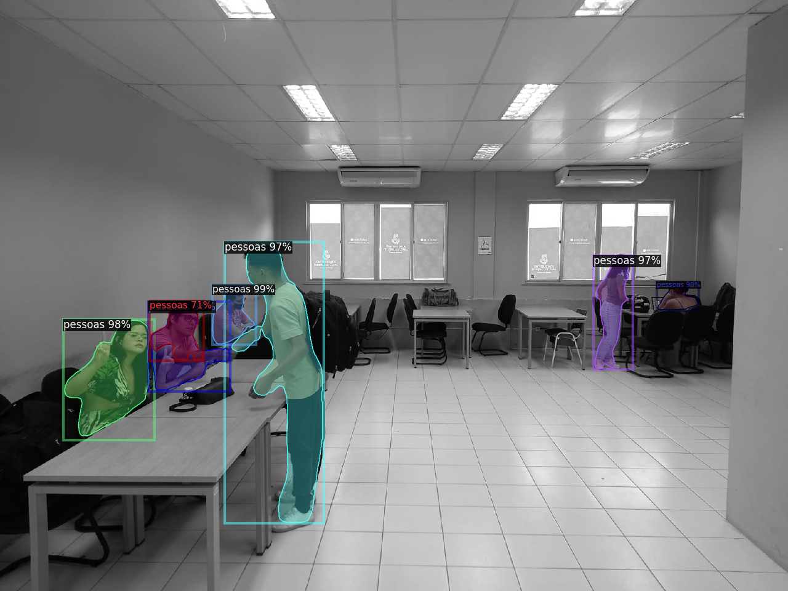

# projeto-deteccao-de-pessoas
Sistema de IA para detecção de pessoas na sala de estudos do Campus da UFC de Itapajé

# Sistema de Detecção de Pessoas em Ambientes do Campus

Este projeto apresenta uma solução de Visão Computacional baseada em Redes Neurais Convolucionais (CNN) para a detecção automática de pessoas. O sistema foi desenvolvido como requisito final da disciplina de Inteligência Artificial (2025.2), utilizando o framework **Detectron2**.

## 🎯 Objetivo e Aplicação em Segurança da Informação

O objetivo principal é monitorar ambientes reais do Campus (laboratórios, corredores e salas de aula) para apoiar a segurança patrimonial e física.

**Aplicações em Segurança:**
1.  **Monitoramento de Perímetro:** Detecção de intrusão em áreas restritas (ex: laboratórios de servidores) fora do horário comercial.
2.  **Análise de Ocupação:** Controle de lotação em tempo real para conformidade com normas de segurança (evacuação) e prevenção de aglomerações.
3.  **Auditoria de Acesso:** Registro visual automatizado de entradas e saídas sem necessidade de intervenção humana constante.

## 🛠️ Tecnologias Utilizadas

* **Linguagem:** Python
* **Framework:** Detectron2 (Facebook AI Research)
* **Modelo Base:** Mask R-CNN (ResNet-50-FPN) pré-treinado no dataset COCO.
* **Técnica:** Transfer Learning (Fine-Tuning) para a classe `pessoas`.
* **Rotulagem:** Roboflow (Formato COCO JSON).

## 📊 Metodologia

1.  **Coleta de Dados:** Foram capturadas ~94 imagens em ambientes do Campus, variando iluminação e ângulos.
2.  **Rotulagem:** Anotação manual utilizando Polígonos (Segmentação de Instâncias) para delimitar precisamente o contorno das pessoas. Esta abordagem permite que o modelo aprenda não apenas a localização (Bounding Box), mas a forma exata dos indivíduos nos ambientes do Campus.
3.  **Treinamento:**
    * **Iterações:** 1000
    * **Learning Rate:** 0.00025
    * **Batch Size:** 2
    * **Num Classes:** 2 (Mapeamento ajustado para compatibilidade com Roboflow).

## 📈 Resultados e Métricas

O modelo alcançou resultados expressivos para o dataset de teste:

| Métrica | Valor | Interpretação |
| :--- | :--- | :--- |
| **mAP (IoU=0.50:0.95)** | **67.1%** | Alta precisão geral na detecção. |
| **AP50 (IoU=0.50)** | **87.8%** | O modelo detecta corretamente a presença humana em quase 88% dos casos. |
| **AP75** | **81.4%** | Alta fidelidade no ajuste da caixa delimitadora. |

### Exemplos Visuais

**1. Detecção em Imagem Estática:**



**2. Monitoramento em Tempo Real (Webcam):**
O sistema é capaz de realizar inferência em vídeo, simulando uma câmera de segurança IP.


## 🚀 Como Executar

O projeto foi otimizado para execução no **Google Colab** (devido ao uso de GPU).

1.  Clone o repositório:
    ```bash
    git clone [https://github.com/mateuzu7/projeto-deteccao-pessoas.git](https://github.com/mateuzu7/projeto-deteccao-pessoas.git)
2.  Organização dos Dados
Certifique-se de que o dataset está estruturado corretamente para que o Detectron2 reconheça o formato COCO:
Imagens: Devem estar em ``data/images/` (subpastas train, valid, test).
Anotações: Os arquivos JSON devem estar em data/annotations/
3.  Instale as dependências:
    ```bash
    pip install -r requirements.txt
    ```
4.  Para realizar inferência em novas imagens:
    ```python
    python inference/test_model.py
    ```

## 📁 Estrutura do Repositório

* `data/`: Amostras do dataset e anotações.
* `training/`: Scripts de configuração e treinamento (Fine-tuning).
* `inference/`: Scripts para teste em imagens e webcam.
* `results/`: Gráficos de métricas e evidências visuais.
* `model/`: (Link para download do modelo .pth).

---
**Autor:** Mateus Oliveira
**Disciplina:** Inteligência Artificial - 2025.2
